# POS Restaurant Operations Scenarios

## Purpose

This document explains the implemented restaurant flow in this repository from the perspective of waiter, kitchen, cashier, and owner dashboard operations.

It is based on a live walkthrough executed on April 1, 2026 against the current codebase and a temporary local dataset prepared for documentation.

## Important Scope Note

- The owner dashboard images in this document are real screenshots captured from `pos-dashboard`.
- The waiter, kitchen, and cashier frontend applications are not present in this repository.
- Because of that, the application-side images below are generated operational flow visuals based on the real API behavior, not literal UI screenshots from those apps.

## Baseline Owner View

Before opening a new table order, the dashboard showed three already paid historical orders, EGP 900 total revenue, top products, and low inventory warnings.

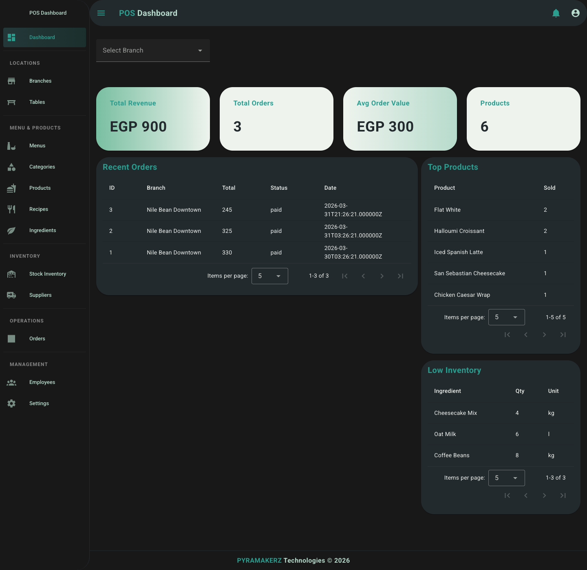

## Scenario A: Full Dine-In Journey

### Step 1: Guests Sit At T2 Window And The Waiter Opens Order #4

- The waiter opens a dine-in order on table `T2 Window`.
- The initial items are `Flat White x2` with modifiers and `Chicken Caesar Wrap x1`.
- The order is created in `pending` state and the table becomes occupied.

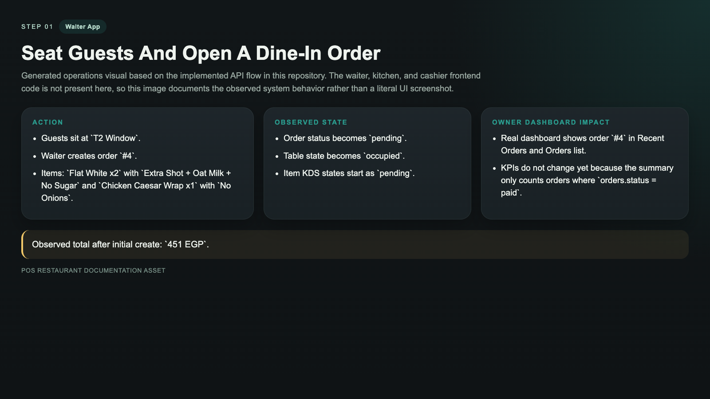

### Step 2: The Waiter Adds Dessert To The Same Open Table

- The waiter adds `San Sebastian Cheesecake x1` to the same open order instead of creating a second order.
- The order total increases and the owner can see the latest pending ticket in dashboard widgets.

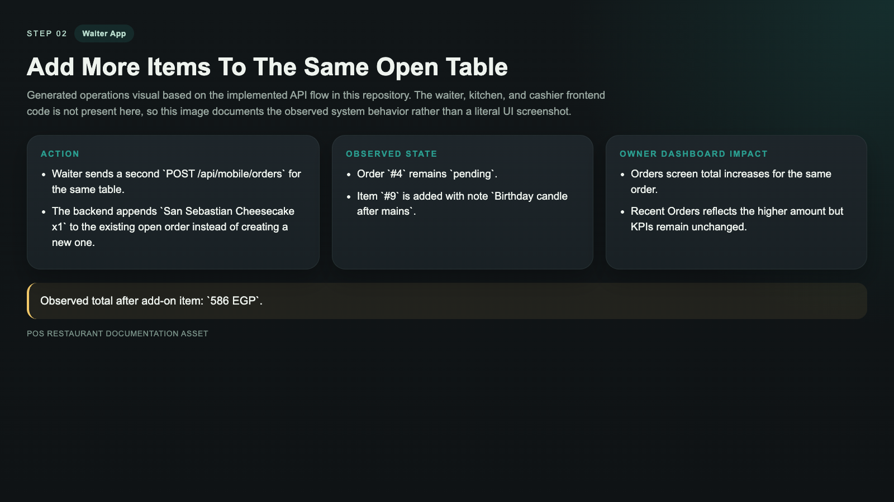

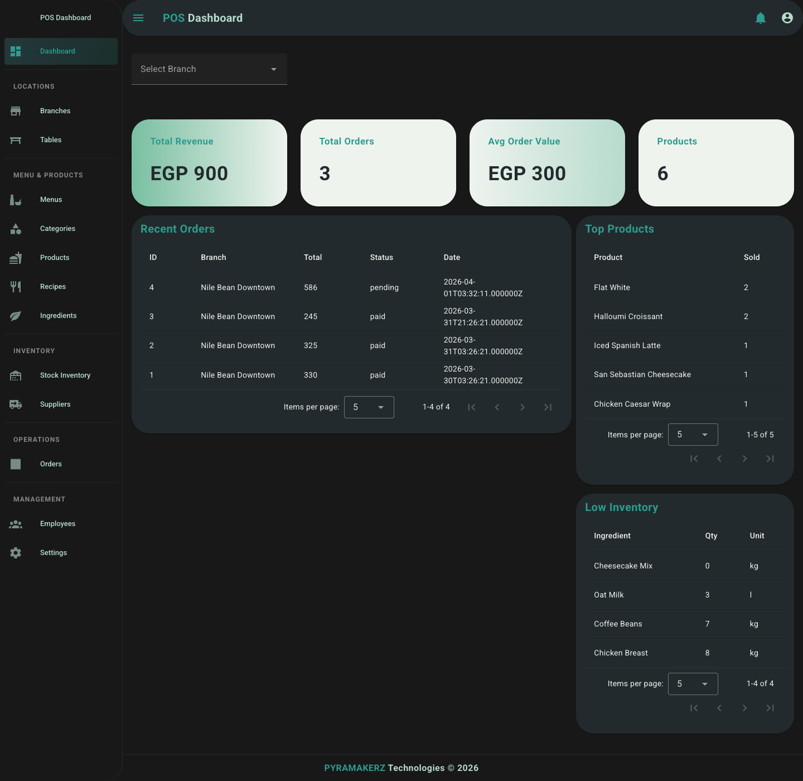

### Step 3: The Waiter Sends The Table To KDS

- The waiter sends the order to the kitchen queue.
- All active items move into `queued` KDS status.
- This is operationally visible in KDS, but the current owner dashboard does not expose item-level KDS progress.

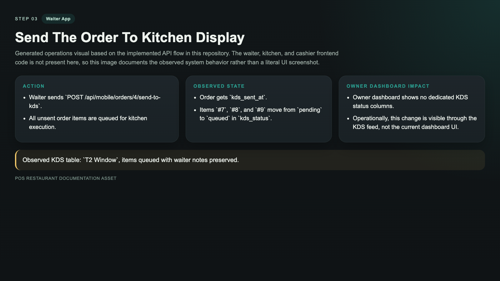

### Step 4: The Customer Changes One Ordered Item

- One guest decides to keep only one coffee instead of two.
- The waiter uses the item change endpoint to reduce quantity.
- The order total is recalculated immediately.

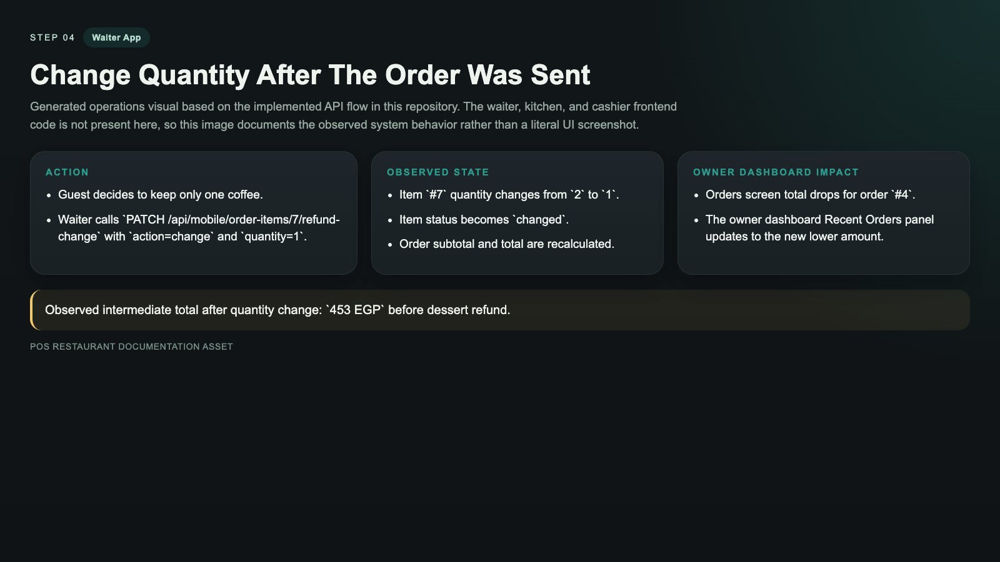

### Step 5: The Customer Cancels Dessert And The Waiter Refunds It

- The dessert is removed from service.
- The item becomes `refunded`, refund amount is stored, and the dessert disappears from active KDS output.
- The owner-facing total is reduced again.

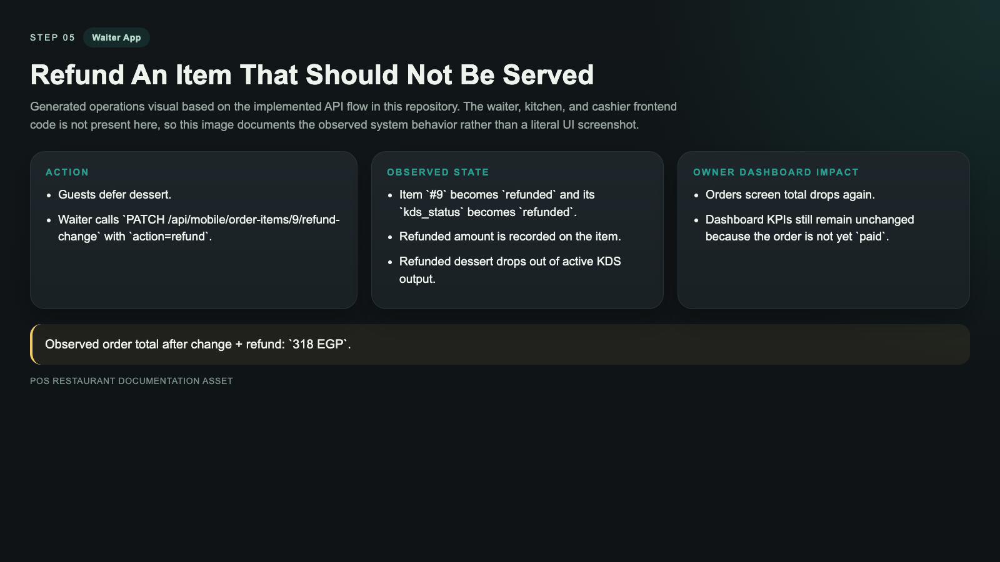

### Step 6: Kitchen Finishes The Remaining Items

- Kitchen marks the remaining active items as `ready`.
- Refunded items stay excluded from the active KDS queue.
- The order is now eligible to move to cashier.

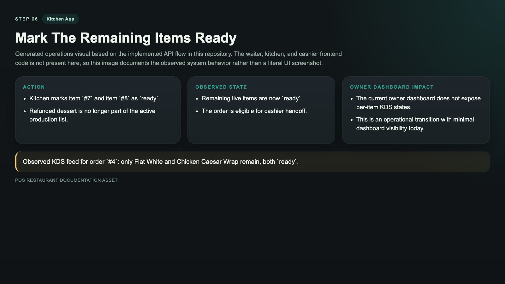

### Step 7: Waiter Sends The Ticket To Cashier

- The waiter sends the order to cashier only after all non-refunded items are ready.
- The order status changes from `pending` to `cashier`.

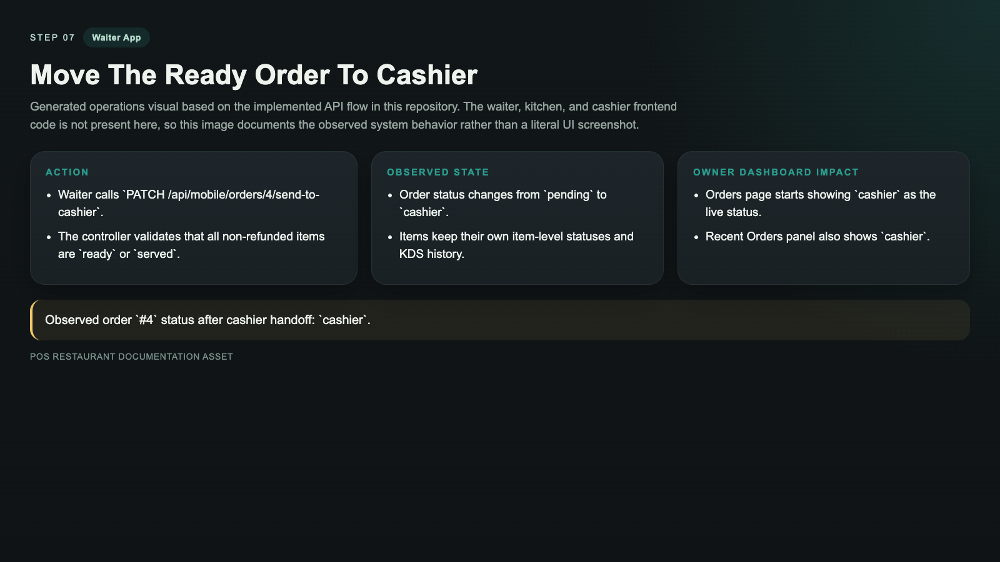

### Step 8: Cashier Takes Payment

- Cashier records a card payment for the exact order total.
- `payment_status` becomes `paid`, `payment_method` is stored, and `paid_at` is recorded.
- In the current implementation, the order status remains `cashier`, so the owner KPI cards still do not count this order as paid revenue.

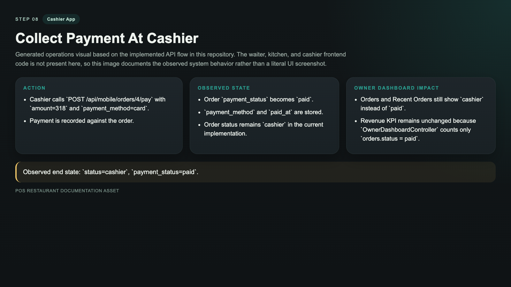

### Step 9: Cashier Reopens The Order For A Missed Sparkling Water

- The cashier reopens the order after payment.
- The waiter adds `Sparkling Water x1`.
- The order goes back to `pending` and the total increases again.

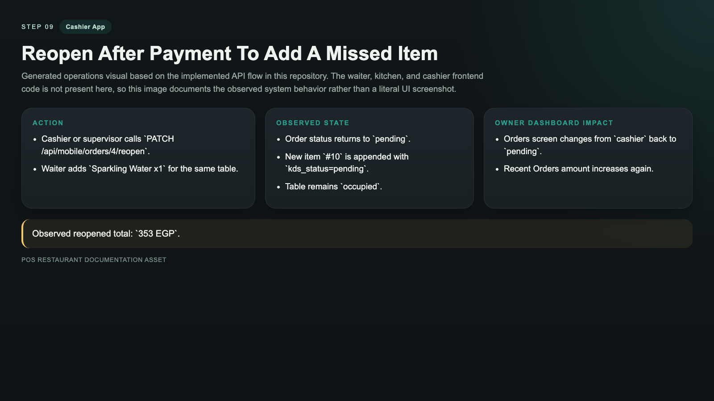

## Scenario B: Move Guests From One Table To Another

### Step 10: Move An Open Table From T1 Terrace To T3 Family

- A separate dine-in order is opened on `T1 Terrace`.
- The waiter moves the open table to `T3 Family`.
- The source order is closed for audit history and a new target order is created on the destination table.
- The owner dashboard then shows both records, which gives traceability for table relocation events.

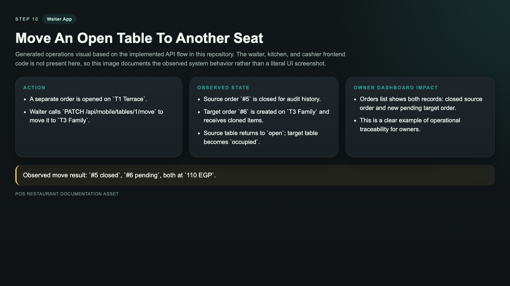

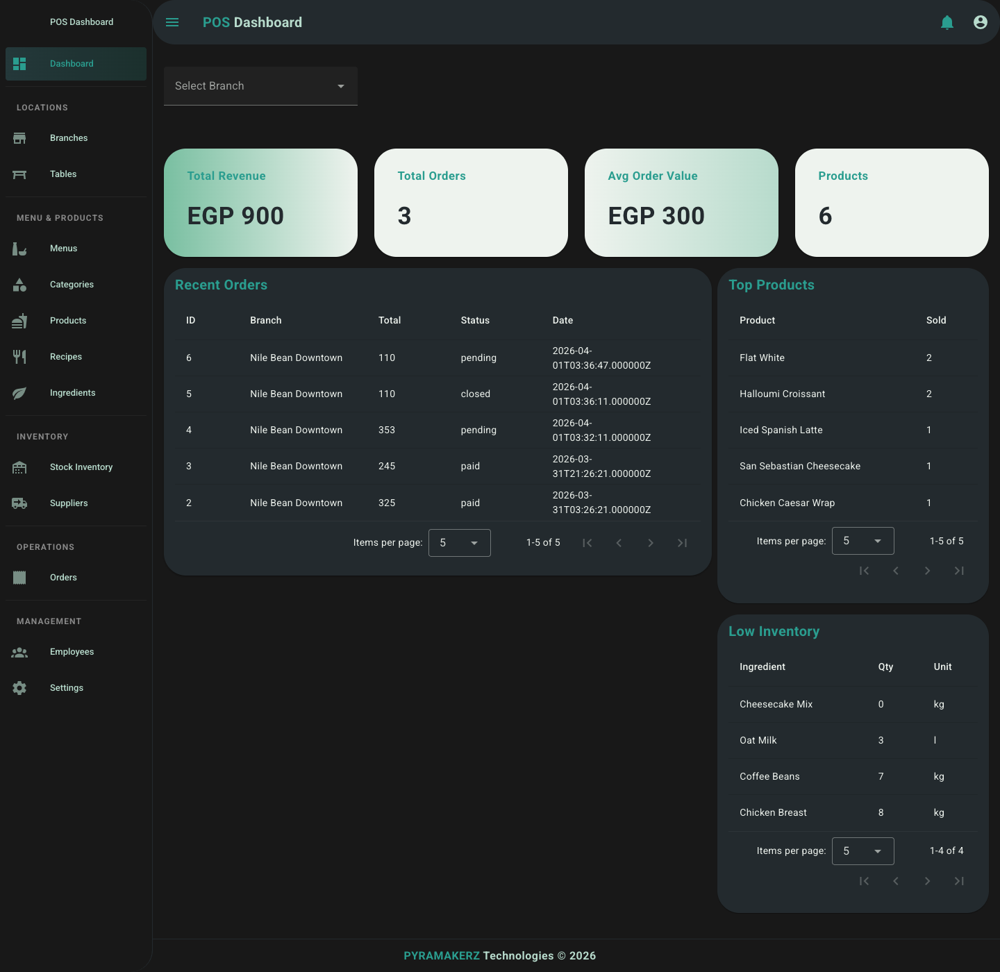

## What The Owner Can See Right Now

- New live orders appear quickly in `Recent Orders`.
- Order totals update after waiter-side item changes and refunds.
- Low-stock ingredients change as ordering reduces stock.
- Closed and moved orders remain visible as audit history.

## Current Observations From The Live Walkthrough

- Dashboard KPI revenue and paid-order counts depend on `orders.status = paid`, not on `payment_status = paid`.
- The payment endpoint currently marks `payment_status` as paid but leaves the order in `cashier`, so revenue cards stay unchanged after payment.
- The current owner dashboard does not show per-item KDS progress.
- The table move flow closes the source order and creates a new destination order, which is good for auditability but important to explain to staff.
- The inventory screen already covers basic inventory records, but stock movement/branch transfer UI is still marked as “Coming soon”.

## Endpoints Exercised In This Document

- `POST /api/mobile/orders`
- `POST /api/mobile/orders/{order}/send-to-kds`
- `PATCH /api/mobile/order-items/{id}/refund-change`
- `PATCH /api/mobile/kds/order-items/{item}`
- `PATCH /api/mobile/orders/{order}/send-to-cashier`
- `POST /api/mobile/orders/{id}/pay`
- `PATCH /api/mobile/orders/{order}/reopen`
- `PATCH /api/mobile/tables/{fromTable}/move`

## Documentation Asset Paths

- Dashboard screenshots: `docs/assets/screenshots/`
- Operation flow visuals: `docs/assets/flow-cards/`
